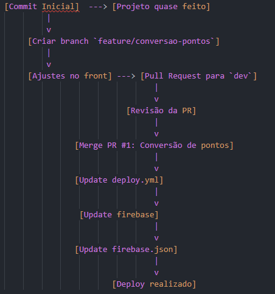
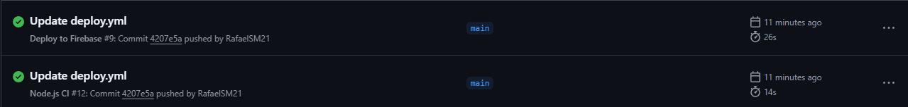
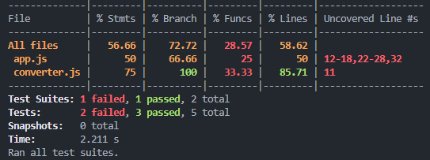

# Atividade Prática de Revisão IEC


---

## Tarefa 1: Fluxo Git

### Modelo de Ramificação (Git Flow)

**Boas Práticas Aplicadas**

**Branches:**

- `main`: Branch principal (produção)
- `dev`: Branch de desenvolvimento
- `feature/*`: Branches para novas funcionalidades

**Merge Requests:**

- Sempre revisados antes do merge
- Uso de `git pull --rebase` para atualizar branches

**Resolução de Conflitos:**

- Utilização de ferramentas de merge (ex: VS Code)

**Fluxograma Completo:**



---

## Tarefa 2: CI com GitHub Actions

### Workflow de CI e Deploy (`.github/workflows/ci.yml`)

**Explicação:**

- **Trigger:** Executa em push e pull requests

**Passos:**

1. Checkout do código
2. Configuração do Node.js
3. Instalação de dependências com `npm ci`
4. Execução de testes com `npm test`

**Alertas:**

- Comentário automático no PR em caso de falha



---

## Tarefa 3: Testes Automatizados

### Estratégia de Cobertura

- Teste de valores positivos, zero e negativos
- Relatório de cobertura gerado com `jest --coverage`
- Busca por 100% de cobertura de código

```bash
npm test -- --coverage
```

Saída do teste:



# Tarefa 4: Monitoramento com Docker

- Não consegui testar devido a um erro em minha maquina de casa

# Tarefa 5: Deploy Firebase

## Configuração de Deploy Contínuo

- Arquivo de configuração: `firebase.json`
- Workflow GitHub Actions responsável pelo deploy: `deploy.yml`
- Deploy automático acionado na branch `main`
